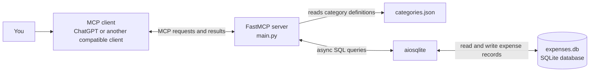

# Test Remote Server

An asynchronous Model Context Protocol (MCP) server for managing expense information. It uses FastMCP to expose server functionality, `aiosqlite` for asynchronous SQLite access, and a JSON file to define expense categories.

## What this project does

This project is the server side of an expense-tracking MCP integration. An MCP-compatible client connects to the server and invokes its available operations. The server uses the category list in `categories.json` and persists expense information in `expenses.db`.

The exact operations, arguments, database schema, and MCP transport are implemented in `main.py`. Review that file for the authoritative API and transport settings.

## Architecture



The MCP client communicates with the running server. `main.py` contains the server entry point and application logic. It reads category definitions from `categories.json` and uses `aiosqlite` to read or write the local SQLite database, `expenses.db`.

## Project files

| File | Purpose |
| --- | --- |
| `main.py` | FastMCP server entry point and expense operations. |
| `categories.json` | Top-level expense categories and their subcategories. |
| `expenses.db` | SQLite storage for expense records. It may be created or updated when the server runs. |
| `pyproject.toml` | Project metadata, Python requirement, dependencies, build backend, and declared CLI entry point. |
| `README.md` | Project documentation. |

## Requirements

- Python 3.11 or newer
- [`uv`](https://docs.astral.sh/uv/) to install and run the project
- An MCP-compatible client to interact with the server

The project dependencies are `fastmcp` and `aiosqlite`; `uv sync` installs them from `pyproject.toml`.

## Install and run

These commands assume you have cloned the repository and opened a terminal in the project directory.

### macOS

Install `uv` using the official installer, then open a new terminal:

```bash
curl -LsSf https://astral.sh/uv/install.sh | sh
cd test-remote-server
uv sync
uv run python main.py
```

### Windows

In PowerShell, install `uv` and then run the project:

```powershell
powershell -ExecutionPolicy ByPass -c "irm https://astral.sh/uv/install.ps1 | iex"
cd test-remote-server
uv sync
uv run python main.py
```

If `uv` is not recognized after installation, close and reopen PowerShell so it reloads the updated PATH.

### Ubuntu

Install `uv` using the official installer, then run:

```bash
curl -LsSf https://astral.sh/uv/install.sh | sh
cd test-remote-server
uv sync
uv run python main.py
```

After installing `uv`, restart the terminal or load the shell configuration if the `uv` command is not yet available.

### Connecting an MCP client

Start the server using the command above, then configure your MCP-compatible client to launch or connect to it. The required client configuration depends on the transport configured in `main.py` and on the client being used. Consult the `main.py` server setup and your client's MCP configuration documentation for the exact command and transport fields.

The project declares this console command in `pyproject.toml`:

```text
test-remote-server
```

Its configured target is `test_remote_server:main`. Use that command only if the corresponding importable module and `main()` function exist in the project; running `uv run python main.py` invokes the file directly.

## Categories

`categories.json` defines categories including food, transport, housing, utilities, health, education, family and kids, entertainment, shopping, subscriptions, travel, taxes, investments, and miscellaneous expenses. Each top-level category contains subcategories. Keep the file valid JSON when editing it.

## ChatGPT subscription note

The MCP server is a Python program and can be installed and run locally without a ChatGPT subscription. A subscription or account feature may affect whether you can connect to this server through ChatGPT. You can still develop the project locally or connect it to another compatible MCP client. Remote use also requires the server to be reachable using a transport supported by the chosen client.

## Contributing

Contributions are welcome. A typical contribution flow is:

1. Fork the repository and create a branch for your change.
2. Make a focused change and update the documentation when behavior or setup changes.
3. Run the server and verify the affected behavior with an MCP client.
4. Open a pull request describing the change and how you verified it.

Please avoid committing personal financial data, credentials, or other secrets. Treat `expenses.db` as private data; use sample data when sharing examples. Back up the database before making manual changes to it.

## Contact

For questions or project contributions, contact **Darshan Kedar** at [red1815@gmail.com](mailto:red1815@gmail.com).
